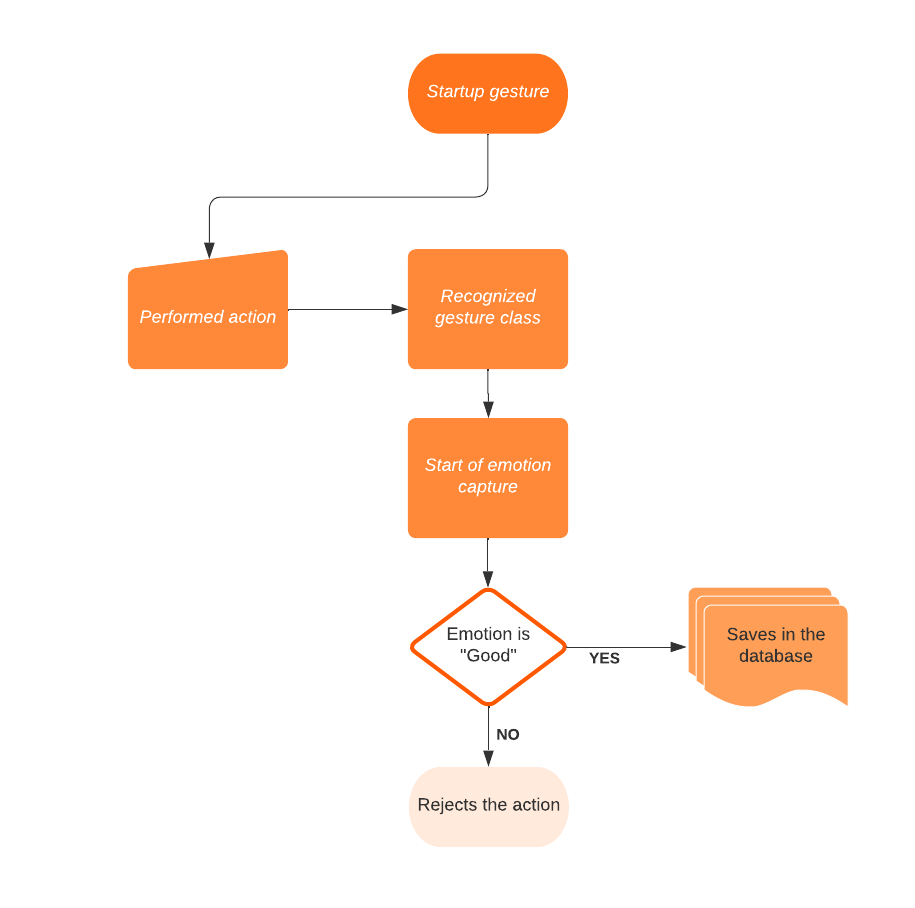

# Emotion-GestureCompiler-main
 Gesture and emotion classifier for autonomous vehicle control.

## Application
The project consists of combining Guilherme's gesture classifier with Boscatti's emotion classifier. Libraries such as scikit-learn, PyTorch, OpenCV, TensorFlow, among others, are used.

This application is an improvement of the research developed by Rafael. All mentioned individuals are members of NERo.

## Installation
The gesture and emotion classifiers are compiled in the code ***EmotionGestureCompiler.py***. Install dependencies using *"pip install requirements.txt"*.
To run only the facial recognition code, found in **emotion_detector.py**, execute the code **main_face.py**.
The complete classifier is executed by **main.py**. Usage parameters can be defined by the user:

  
